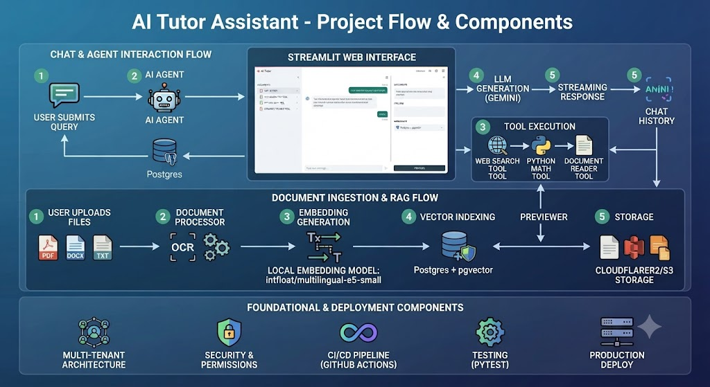

# 🎓 AI Tutor Assistant — Enterprise-Grade RAG & AI Learning Platform
*A Production-Ready, Multi-User AI Learning Platform built with LangChain, LangGraph, Streamlit, PostgreSQL (pgvector), and Cloudflare R2 Object Storage.*

🌐 **Live Demo:** [AI Tutor Assistant App](https://ai-tutor-assistant-mth.streamlit.app)

---

## 🏷️ Tech Stack & Badges
<p align="left">
  
  
  
  
  
  
  
  
  
  
  
  
</p>

---

## 📊 Kiến trúc tổng quan & Luồng hoạt động (Architecture & Flow)

<p align="center">
  
</p>

---

## 🚀 1. Tổng quan dự án
**AI Tutor** là ứng dụng trợ lý học tập thông minh cho phép người dùng upload tài liệu (PDF, DOCX, TXT), lưu trữ vĩnh viễn trên Cloud Object Storage, quản lý không gian làm việc (workspace) thông minh qua URL và Database, thực hiện tìm kiếm kết hợp (Hybrid Search) và tương tác với AI Agent hỗ trợ gọi công cụ (Web Search, Python REPL, Document Reader). Dự án được thiết kế theo kiến trúc phân tầng (layered architecture) chuẩn **Production-Ready**.

---

## 🛠️ 2. Tech Stack & Architecture
* **Frontend / UI**: Streamlit (Responsive Layout, Dynamic Sidebar, Toggleable Preview Panel, Custom CSS Chat Bubbles).
* **AI & Agentic Framework**: LangChain, LangGraph (Stateful Agent, Streaming response, Tool calling).
* **LLM & Embeddings**: Google Gemini API (LLM) + HuggingFace Embeddings (`BAAI/bge-m3` chạy local tối ưu chi phí).
* **Database & Vector Search**: PostgreSQL với extension **pgvector**, hỗ trợ Hybrid Search (Vector + Full-Text Search qua Reciprocal Rank Fusion).
* **Cloud Storage**: Cloudflare R2 (Tương thích chuẩn S3 API) lưu trữ tài liệu gốc, đảm bảo tính năng xem trước hoạt động ổn định trên Cloud.
* **Observability & CI/CD**: Context-based Logging (`workspace_id`), Duration Performance Decorators, Pytest, GitHub Actions CI.

---

## 📂 3. Cấu trúc thư mục (Clean Architecture)


```
ai_tutor/
├── app.py                  # Entry point Streamlit — CHỈ điều phối UI (~100 dòng)
├── config.py                # Đọc .env, dataclass cấu hình, logger + observability
├── exceptions.py             # Hệ thống exception riêng (AITutorError và các lớp con)
├── database.py               # PostgreSQL + pgvector, hybrid search, lịch sử chat
├── document_processor.py     # Đọc PDF/DOCX/TXT, OCR, chunking (fixed/semantic)
├── storage.py              # Quản lý Cloud Object Storage (S3/R2) cho file xem trước
├── tools.py                   # web_search_tool, python_math_tool, document_reader_tool
├── agent.py                  # LLM Gemini + LangGraph agent, ask/stream
├── ui/
│   ├── __init__.py
│   ├── styles.py              # CSS
│   ├── sidebar.py             # Workspace + upload & xử lý tài liệu
│   ├── preview.py             # Xem trước tài liệu
│   └── chat.py                # Giao diện chat (streaming + lưu lịch sử)
├── tests/                     # pytest, mock toàn bộ DB/API thật (xem mục 9)
│   ├── conftest.py
│   ├── test_config.py
│   ├── test_document_processor.py
│   ├── test_database.py
│   ├── test_tools.py
│   └── test_agent.py
├── .github/workflows/ci.yml   # Lint (ruff) + test (pytest) tự động trên mỗi push/PR
├── requirements.txt
├── requirements-dev.txt       # pytest, ruff — chỉ cần cho dev/CI
├── pyproject.toml             # Cấu hình ruff + pytest
├── packages.txt               # Gói hệ thống (apt) cho OCR — Streamlit Cloud tự đọc
├── Dockerfile
├── docker-compose.yml
├── .dockerignore
├── .gitignore
├── .env.example
└── README.md
```

## 4. Các điểm nổi bật về Kỹ thuật & Nghiệp vụ

### 🌟 4.1. Giải quyết lưu trữ trên Cloud & Tối ưu Workspace (Lazy Creation)
* **Cloud-Native Persistence**: Tài liệu upload được đẩy trực tiếp lên Cloudflare R2 qua `boto3` theo cấu trúc `workspaces/{workspace_id}/{file_name}`, giúp tính năng **Xem trước tài liệu** hoạt động mượt mà ngay cả khi F5 hoặc deploy trên Streamlit Community Cloud (vốn dùng ephemeral file system).
* **Lazy Workspace Creation**: Khắc phục triệt để tình trạng sinh workspace rác khi người dùng chỉ truy cập web rồi tắt đi. Workspace chỉ được chính thức ghi nhận vào PostgreSQL khi người dùng thực hiện **gửi tin nhắn đầu tiên** hoặc **bấm xử lý tài liệu**.

### 🔍 4.2. RAG Nâng cao (Advanced RAG Pipeline)
* **Embedding Local (`BAAI/bge-m3`)**: Tránh hoàn toàn lỗi giới hạn quota (Rate-limit) khi index tài liệu dung lượng lớn.
* **Hybrid Search**: Kết hợp vector search với full-text search của PostgreSQL thông qua thuật toán **Reciprocal Rank Fusion (RRF)**, giúp truy xuất chính xác các số liệu, từ khóa kỹ thuật.
* **OCR Tự động**: Nhận diện PDF dạng scan ảnh và tự động kích hoạt OCR (`pytesseract` + `pdf2image`) mượt mà.

### 🌐 4.3. Quản lý trạng thái qua URL & Database
* **Stateful qua URL (`?ws=...`)**: Trạng thái phiên làm việc gắn liền với URL, cho phép chia sẻ link workspace chứa sẵn bộ tài liệu cho người khác.
* **Database Management**: Lưu trữ lịch sử chat và dữ liệu workspace đồng bộ. Hỗ trợ đầy đủ thao tác Tạo mới, Đổi tên, và Xóa sạch dữ liệu (dọn dẹp cả vector embedding lẫn file trên Cloud Storage).

---

## 🧪 5. Kiểm thử tự động (Testing) & CI/CD
* **Unit Testing**: Bộ test viết bằng `pytest` đạt độ cô lập cao nhờ mock toàn bộ kết nối DB và external API, không yêu cầu cấu hình phức tạp khi chạy test.
* **CI/CD Pipeline**: Thiết lập GitHub Actions (`.github/workflows/ci.yml`) tự động chạy linter (`ruff`) và bộ test suite (`pytest`) trên mọi lệnh `push` hoặc `Pull Request`.

### Chạy Postgres + pgvector cục bộ (Docker)

```yaml
# docker-compose.yml (ví dụ, đặt cạnh app)
services:
  db:
    image: pgvector/pgvector:pg16
    environment:
      POSTGRES_DB: ai_tutor
      POSTGRES_USER: ai_tutor_app
      POSTGRES_PASSWORD: change_me
    ports:
      - "5432:5432"
    volumes:
      - pgdata:/var/lib/postgresql/data
volumes:
  pgdata:
```

`database.check_database_connection()` tự động chạy
`CREATE EXTENSION IF NOT EXISTS vector;` khi khởi động — chỉ cần user có
quyền tạo extension (hoặc DBA tạo trước).


## 🔍 6. Quan sát hệ thống (Observability)

**Log tự động gắn `workspace_id`**: `config.set_log_context(workspace_id)`
được gọi 1 lần ở đầu `app.main()`, dùng `contextvars` (an toàn theo từng luồng
chạy). Từ đó, MỌI dòng log ở `database.py`, `tools.py`, `agent.py` tự động
có `ws=<workspace_id>` mà không cần truyền tay qua từng hàm — khi debug
production nhiều người dùng chung app, lọc log theo đúng người dùng bằng
`grep "ws=ws_abc123"` thay vì phải đoán dòng nào của ai.

**Đo thời gian các bước tốn tài nguyên**: decorator `config.log_duration()`
áp cho `ask_agent`, `web_search_tool`, `python_math_tool`, `index_chunks`,
`hybrid_search`, và toàn bộ nhóm hàm quản lý workspace (`get_all_workspaces`,
`ensure_workspace_exists`, `rename_workspace`, `delete_workspace`,
`get_indexed_files`) — tự động log `⏱ <tên bước> hoàn thành sau X.XXs`. Giúp phát
hiện điểm nghẽn hiệu năng (vd embedding chậm vì máy yếu, hay Cohere rerank
chậm bất thường) mà không cần thêm code đo thời gian thủ công ở từng nơi.
`document_reader_tool` (được tạo qua `@tool` decorator nên không áp
`log_duration` trực tiếp được) đo thời gian thủ công bằng `time.perf_counter()`.

**Log lifecycle của workspace ở đúng mức độ**: các thao tác người dùng chủ
động thực hiện — tạo mới, đổi tên, xóa workspace — log ở mức **INFO** (đáng
để thấy ngay trong log mặc định). Các hàm bị gọi ở MỌI lần Streamlit rerun
script (`get_all_workspaces`, `ensure_workspace_exists` khi không có gì thay
đổi, `get_indexed_files`) log ở mức **DEBUG**, tránh làm ngập log sản xuất
bằng những dòng lặp lại vô nghĩa mỗi lần người dùng gõ 1 ký tự.

**LangSmith tracing (tuỳ chọn, không cần sửa code)**: đặt 3 biến môi trường
trong `.env` (đã có mẫu, comment sẵn):
```
LANGSMITH_TRACING=true
LANGSMITH_API_KEY=...
LANGSMITH_PROJECT=ai-tutor
```
LangChain/LangGraph tự động đọc các biến này và gửi trace chi tiết (tool nào
được gọi theo thứ tự nào, prompt/response đầy đủ ở từng bước, latency từng
bước) lên dashboard tại smith.langchain.com — hữu ích hơn nhiều so với đọc
log thô khi cần debug hành vi của agent (vd vì sao agent không gọi tool như
kỳ vọng). Có gói free đủ dùng cho quy mô nhỏ; kiểm tra hạn mức hiện tại tại
trang chủ LangSmith trước khi dùng cho production.

**Hướng mở rộng tiếp theo** (chưa implement, gợi ý cho tương lai):
- Structured logging dạng JSON (thay vì text) để đưa vào hệ thống log tập
  trung (Datadog, Grafana Loki, CloudWatch...).
- Metrics dạng số (Prometheus) cho: số câu hỏi/phút, tỷ lệ lỗi từng tool, độ
  trễ trung bình — hiện chỉ có log dạng text, cần parse mới ra được số liệu
  tổng hợp.
- Alert tự động khi tỷ lệ lỗi Cohere/Gemini vượt ngưỡng trong khoảng thời
  gian ngắn (dấu hiệu hết quota hoặc key hết hạn).
